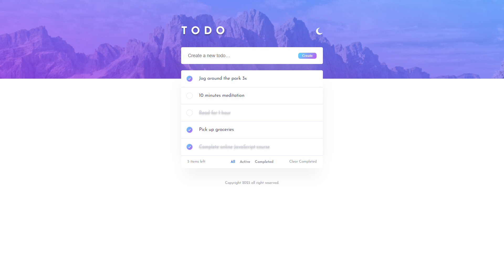
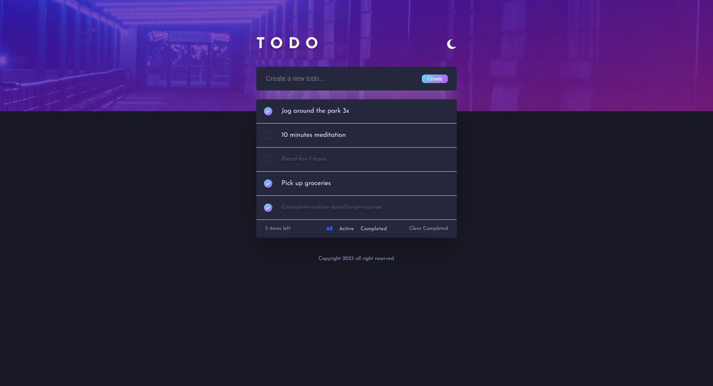
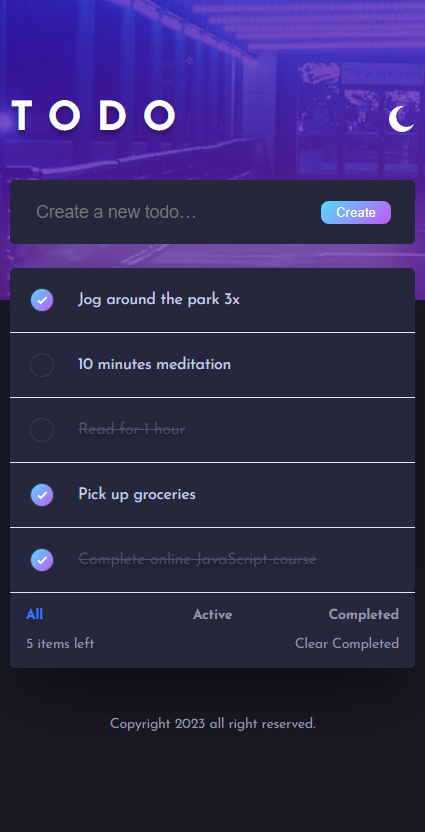

# Todo List App



## Description

This is a simple Todo list app built with React and implemented using class components. The app allows users to manage their tasks by adding new ones, marking them as completed, and filtering based on their completion status. The state of the application is managed within the class components, and the UI is styled using CSS. Additionally, the app features a dark/light theme toggle, allowing users to switch between light and dark themes based on their preference.

## Features

- Add new tasks to the list.
- Mark tasks as completed.
- Filter tasks by completion status.
- Toggle between light and dark themes.

## Installation

1. Clone the repository:
```
git clone https://github.com/BOGomDAH/todo_app.git
```
2. Install dependencies:
```
cd todo_app
npm install
```
3. Start the development server:
```
npm start
```

## Technologies Used

- React
- CSS

## Screenshots




## License

This project is licensed under the MIT License. See the [LICENSE](LICENSE) file for details.

## Author

- Rogozinskii Bogdan
- GitHub: [@BOGomDAH](https://github.com/BOGomDAH)
- Email: legor3455@gmail.com